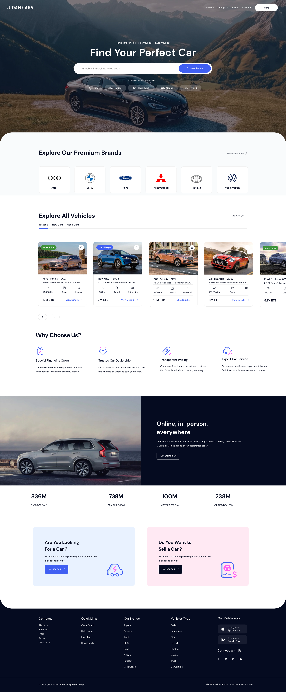

# **Judah Cars**  
# 🚗 **Car Dealership SPA** – *React E-Commerce Project* 
🌐 **https://judah-cars.vercel.app**

# 🚗 **Car Dealership SPA** – *React E-Commerce Project*

A responsive, interactive Single Page Application (**SPA**) built with **React** for a **car dealership platform**. Buyers can explore cars, and sellers can manage listings. It is connected to a springboot backend(https://github.com/robajo1/JudahCars-Backend.git).

---

## ✅ **Features**

### 🔍 **Buyer**
- Browse cars by **category**, **price**, or **keywords** and **and some much more**
- View detailed car info: *images, price, description, seller*
- Add to **shopping cart** *(stored in local state)*
- **Save favorites** and **message sellers** *(bonus)*
- Optional **JWT login** for buyers
- **3D models for car preview** for buyers

### 🛠️ **Seller**
- **Secure login** with JWT token-based auth
- Access to **protected dashboard**
- **Post, edit, delete** car listings(mocked)
- **Image upload preview** (mocked)
- **Buyer messaging inbox** *(bonus)*
- Cached dashboard data for performance

---

## ⚙️ **Tech Stack & Highlights**
- ⚛️ **React Hooks**: `useState`, `useEffect`, custom hooks
- 🛣️ **React Router** with protected routes
- ✨ **ES6+ Features**:
  - Arrow functions, destructuring
  - Spread/rest operators
  - Template literals
  - Modules (import/export)
- 🔐 **JWT Authentication** + secure token storage
- 🧱 **DTO Pattern** for API data structure
- 🎨 **Tailwind CSS + Regular CSS** for responsive, clean design(a bit more on regular to be fair), animation
- 💾 **LocalStorage + caching** strategies

---
## ⚙️ **Group members**
- Robel Nigusse
- Dawit Enku
- Nahom Kiflu

